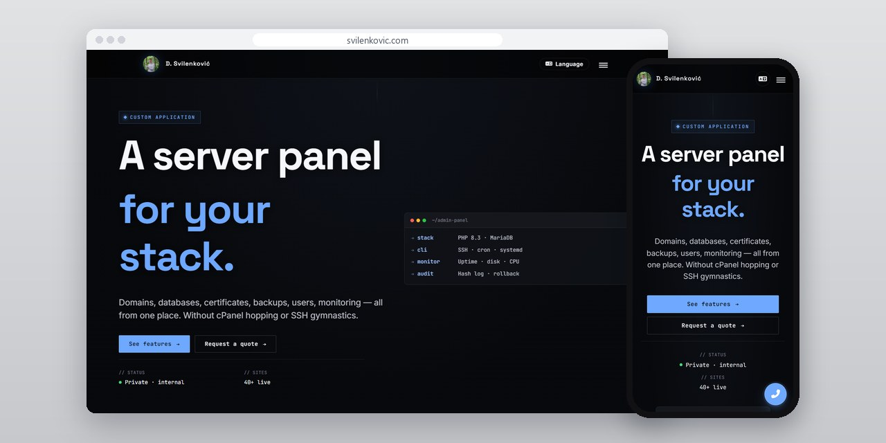
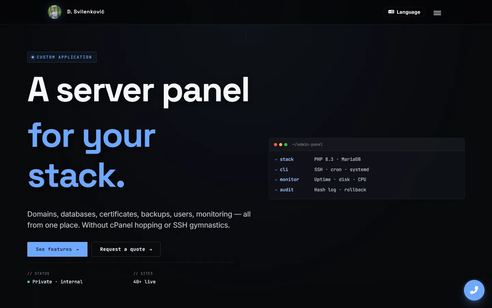
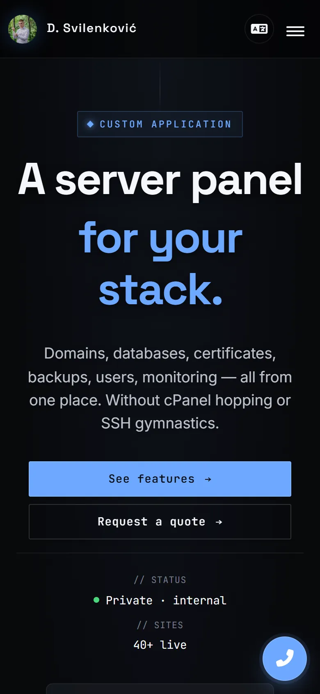

# Admin Panel

My internal panel for the sites I host: clients, billing with exchange rates, reminders, statistics, and CLI and cron jobs over SSH.

[App page](https://svilenkovic.com/en/aplikacija-admin-panel) · [Srpski](README.sr.md)

> [!NOTE]
> My own product. The source code is private. This page describes what it does and how it is built.

<table>
  <tr><td><b>Client</b></td><td>Own product</td></tr>
  <tr><td><b>Industry</b></td><td>Hosting and site management</td></tr>
  <tr><td><b>Location</b></td><td>Serbia</td></tr>
  <tr><td><b>Type</b></td><td>Internal web app</td></tr>
  <tr><td><b>My role</b></td><td>Design, development and maintenance</td></tr>
  <tr><td><b>Stack</b></td><td>PHP 8.3, MariaDB, SSH, cron, systemd</td></tr>
</table>

## About the project

This is the panel I run my hosting work from. It keeps the sites, the clients they belong to, billing with exchange rates, reminders and statistics in one app. Next to each domain it shows the certificate status, and monitoring watches uptime, disk and CPU.

Work on the servers goes over SSH, and the panel runs CLI commands and cron jobs the same way. Every change goes into an audit log that records who changed what and when. The entries are hashed, so the log cannot be cleaned up quietly after the fact.

## What I built

- Sites and the clients they belong to, with the certificate status of each domain
- Billing and exchange rates in the same app as the sites and clients
- Reminders and statistics over the same data
- CLI commands and cron jobs that run over SSH
- Monitoring of uptime, disk and CPU, with an alert when something crosses a threshold
- An audit log of who changed what and when, hashed so entries cannot be removed quietly

## Screenshots

<table>
  <tr>
    <td width="68%" valign="top"></td>
    <td width="32%" valign="top"></td>
  </tr>
</table>

---

Built by [D. Svilenković](https://svilenkovic.com).
